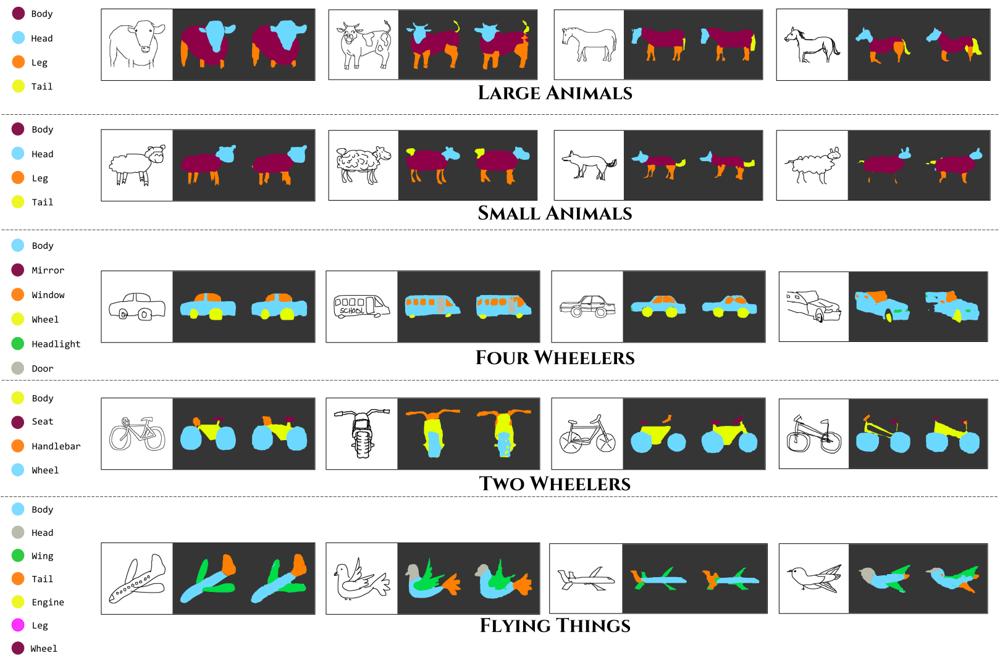
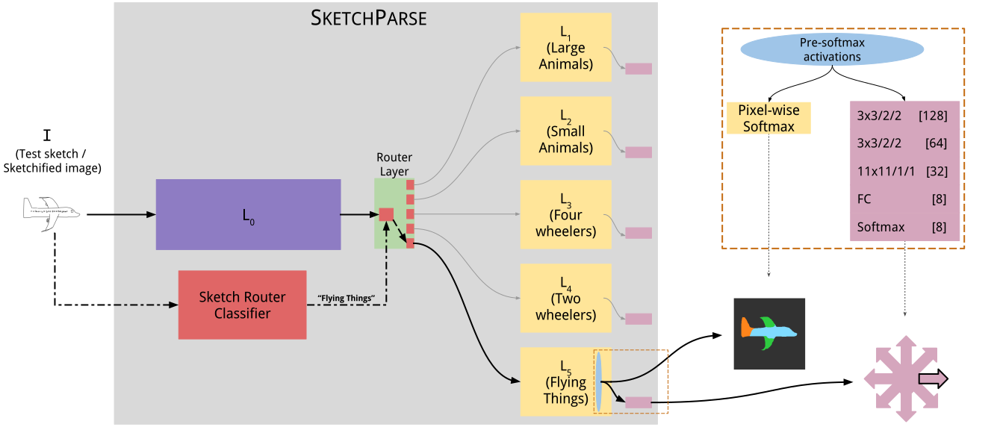

# sketch-parse

### This repository contains code and additional material for our paper titled "[SketchParse: Towards Rich Descriptions For Poorly Drawn Sketches Using Multi-Task Deep Networks](https://arxiv.org/pdf/1709.01295)", ACM Multimedia (ACMMM) 2017.

This is a neural network for (semantic) sketch segmentation. Use it to associate semantics with your freehand sketches!

The four panels are chosen from the 100th, 75th, 50th, 25th percentile accuracy of segmentation (by IoU) respectively. As you can see, even in (relatively) bad cases, we can provide fairly accurate segmentations!

# Model

We have a multi-task deep neural network that can segment freehand sketches as well as predict a global pose:

# Contents

* For code and corresponding instructions, navigate to [exp-src](https://github.com/val-iisc/sketch-parse/tree/master/exp-src)

* For annotation software tool and corresponding instructions, navigate to [valsketch](https://github.com/val-iisc/sketch-parse/tree/master/valsketch)

* For retrieval code, models and a demo, navigate to [retrieval-src](https://github.com/val-iisc/sketch-parse/tree/master/retrieval-src)

* For instructions to get annotated sketch dataset, navigate to [exp-src/data/sketch-dataset](https://github.com/val-iisc/sketch-parse/tree/master/exp-src/data/sketch-dataset). Pose dataset is present in [`exp-src/data/lists/Pose_all_label.txt`](https://github.com/val-iisc/sketch-parse/blob/master/exp-src/data/lists/Pose_all_label.txt). Find instruction regarding pose dataset [here](https://github.com/val-iisc/sketch-parse/tree/master/exp-src/data/lists).

# Requirements

This code was developed and tested on an Ubuntu 14.04 machine with python 2.7 and pyTorch (v0.1.12). We used an NVIDIA TITAN X for training and evaluating our model.

#### If you use this work, please cite the paper:

[SketchParse: Towards Rich Descriptions For Poorly Drawn Sketches Using Multi-Task Deep Networks](https://arxiv.org/pdf/1709.01295) 

#### Questions ?

* For questions regarding the main segmentation network, please contact Isht (isht.dwivedi@gmail.com)

* For questions regarding the annotation tool, please contact Sahil (sahil.manocha1995@gmail.com)

* For questions regarding the pose subnetwork and the sketch-based image retrieval application, please contact Abhijat (abhijatbiswas@gmail.com)

* For any other questions, please contact Ravi (ravika@gmail.com)
